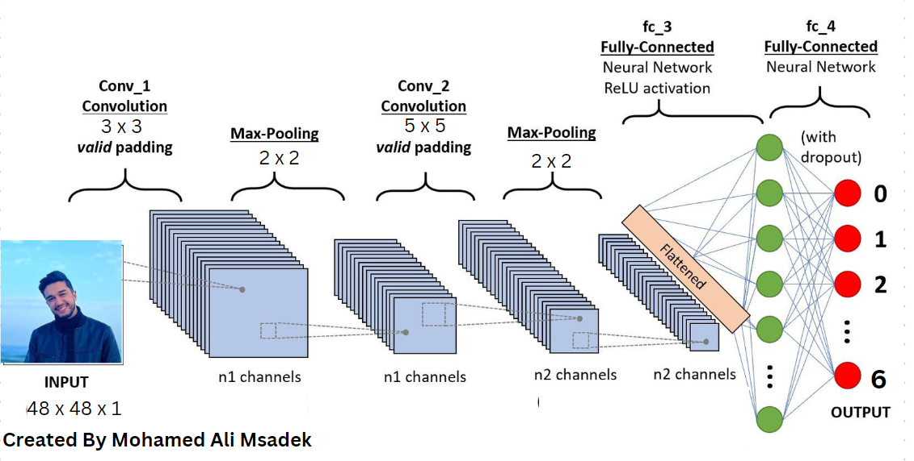

# Emotion Detection with CNN

## Overview

This project focuses on Emotion Recognition using a Convolutional Neural Network (CNN) architecture . The system is designed to analyze facial expressions and determine the emotion portrayed in the face.




## Project Structure

The project structure is organized into the following folders:

- **model:** Contains the pre-trained model file (`model.h5`) for Emotion Recognition.
- **data:** Placeholder for datasets or any necessary data.
- **xml:** Placeholder for XML files.
- **working:**
  - `dependencies.py`: File containing project dependencies.
  - `model.py`: File defining the architecture of the CNN model.
  - `split_data.py`: File implementing data splitting strategies.
  - `test.py`: File shows the performance of the model on the test data.
  - `train.py`: File handling model training.
  - `main.py`: Main executable file to run the Emotion Detection system.

## Usage

1. Clone the repository:

   ```bash
   git clone https://github.com/dalimsadek/Emotion_Detection.git
2. Navigate to the project directory:
   ```bash
    cd Emotion_Detection
3. install dependecies:
   ```bash
    pip install -r requirements.txt

4. Run the main script:
   ```bash
    python main.py

5. Run the necessary scripts according to your needs:
     ```bash
    python split_data.py
    python train.py
    python test.py
## Contributing
If you're interested in contributing to the project or have suggestions, feel free to create issues or submit pull requests.

## Contact
For inquiries or further information, please contact me:

Maintainer: [Mohamed Ali Msadek] (Mohamedali.msadek@supcom.tn)


